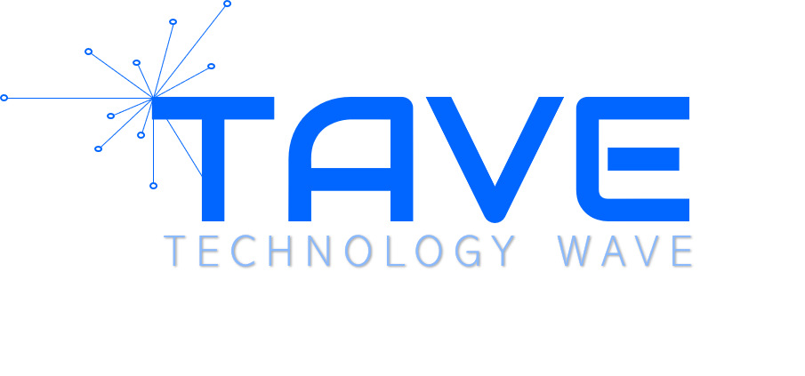

# 테이브 딥러닝 스터디
- 기간: 2021.09 - Now
- 시간: 매주 금요일 저녁 8시 30분 - 10시 30분

## 참여인원

- (OB) [박제윤](http://jeiyoon.github.io/), 이문기, 허주희, [안세윤](https://yunniya097.github.io/), 채원석, 하정현
- (YB) [권기호](https://chocochip101.tistory.com/), 이아현, 서가을, 고성호

## 공부자료

- [핸즈온 머신러닝](https://github.com/rickiepark/handson-ml2)
- [NVIDIA DLI CIP - Fundamentals of Deep Learning](https://github.com/Jeiyoon/NVIDIA_fundamentals_of_deep_learning)

## 목차

- CHAPTER 10 케라스를 사용한 인공 신경망 소개 [✔]
- CHAPTER 11 심층 신경망 훈련하기 [✔]
- CHAPTER 12 텐서플로를 사용한 사용자 정의 모델과 훈련 [✔]
- CHAPTER 13 텐서플로에서 데이터 적재와 전처리하기
- CHAPTER 14 합성곱 신경망을 사용한 컴퓨터 비전
- CHAPTER 15 RNN과 CNN을 사용해 시퀀스 처리하기
- CHAPTER 16 RNN과 어텐션을 사용한 자연어 처리
- CHAPTER 17 오토인코더와 GAN을 사용한 표현 학습과 생성적 학습
- CHAPTER 18 강화 학습
- CHAPTER 19 대규모 텐서플로 모델 훈련과 배포

## 스케쥴

- Notion: https://tall-hardware-692.notion.site/Deep-Learning-Study-TAVE-77f7ed1e29a84457b2ade2bd8d57b8f8

<!--  -->
<!--  -->
   
